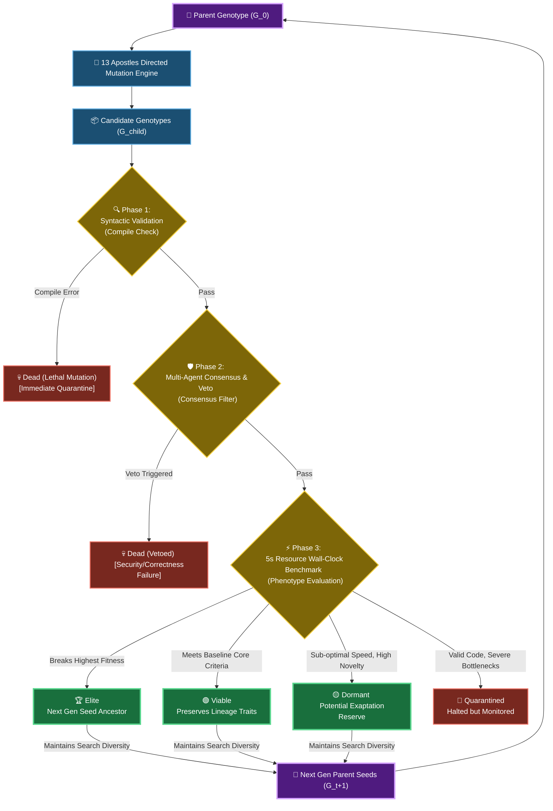

# 🧬 13 Apostles: Autonomous Multi-Agent Code Evolution Framework

> **An autonomous, self-modifying software evolution engine that optimizes programs under strict multi-dimensional selection pressures via LLM-driven *directed mutations* and *consensus veto selection* by 13 cognitive AI personas.**
> 
> *Empirically validated on a phylogenetic tree of **321 unique compile-ready organisms** spanning 7 generations under strict wall-clock execution guards.*

👉 **[Launch Live Serverless WebAssembly Dashboard on GitHub Pages](https://eljja.github.io/13apostles/)**

---

## 🚀 Recent Updates (System Architecture Refactoring)
*   **WebAssembly (stlite) Architecture**: Fully ported the Streamlit dashboard to run entirely in the browser using Pyodide and `stlite`, without needing a python backend!
*   **Performance & Reliability**: Enhanced JSON parsing of LLM outputs (stripping markdown aggressively) and added exponential backoff for API rate-limits.
*   **Client-Side Caching**: Integrated `@functools.lru_cache` for WebAssembly HTTP virtual file system fetching, drastically reducing latency.
*   **Search Engine Optimization**: Complete Google SEO tags and Open Graph preview metadata applied to GitHub Pages.

---

## 🗺️ 1. System Architecture

The 13 Apostles is not a simple greedy optimizer. It is designed under a deep biological philosophy: **short-term computational inefficiencies and non-optimal variants must be preserved if they contain novel structural signatures (Dormant states) to serve as genetic building blocks for future macro-evolutionary breakthroughs.** 

It overcomes the classic **syntactic collapse (lethal mutations)** bottleneck of traditional Genetic Programming (GP) by using LLM-guided directed mutations, which are filtered by 13 multi-agent cognitive personas evaluating long-term architectural potential and strict resource limits.



---

## ⚡ Key Mathematical & Empirical Formulations (S-LTEE)

Through comprehensive analysis of our 321-node silicon tree, the system demonstrated several core biological evolutionary mechanics formalized under rigorous mathematical frameworks:

*   **Directed Mutation AST Operators**: Rather than random AST edits causing a $91.6\%$ syntactic failure rate, the LLM-driven mutators enforce a syntax-preserving probability distribution over AST transitions:
    $$\sum_{G_{\text{cand}} \in \mathcal{L}} P(G_{\text{cand}} \mid G, a_j, \mathcal{C}) \ge 1 - \delta \quad (\delta < 10^{-3})$$
*   **Pareto-Veto Social Consensus Choice**: Resolves Arrow's Impossibility Theorem by mapping the Apostles' multi-agent utility functions to a stable cooperative Nash Equilibrium core:
    $$\mathcal{C}(\mathcal{G}) = \left\{ G_{\text{cand}} \in \mathcal{G} \;\middle|\; \sum_{j=1}^{13} V_j(G_{\text{cand}}) = 0 \text{ and } \nexists G' \in \mathcal{G} \text{ s.t. } \forall j, \mathbf{U}_j(G') \ge \mathbf{U}_j(G_{\text{cand}}) \right\}$$
*   **The Mutational Cushioning Theorem**: Evolved non-coding structures (pseudogenes and spandrels) function as introns, absorbing syntactic noise under a **fixed global mutation budget $\lambda$** to mathematically protect active exons from syntactic collapse:
    $$P(\mathcal{D}_{\text{collapse}}) = 1 - e^{-\lambda(1 - \alpha)} \quad \left(\text{where } \frac{d}{d\alpha} P(\mathcal{D}_{\text{collapse}}) < 0 \right)$$
*   **Continuous-Time Replicator Sweep**: The sieved `04` lineage colonized **$96.7\%$ ($310/321$)** of the ecosystem, showing a classic selective sweep driven by time-guard selection pressure:
    $$x_i(t) = \frac{x_i(0) e^{s_i t}}{\sum_k x_k(0) e^{s_k t}} \xrightarrow{t \to \infty} 1$$
*   **Clonal Interference & Finite Population Regimes**: Highly adapted sub-lineages (`046880b` and `046986c`) compete under clonal interference, protecting lineage diversity from monoculture-induced extinction:
    $$P_{\text{fix}}(A) = s_A \cdot \exp\left( - \int_0^{\tau_A} N \mu_B s_B e^{s_B t} dt \right)$$

---

## 🛠️ Main Features

1. **🧬 13 Apostles Directed Mutation**: Melchior (Performance), Balthasar (Readability/Safety), Casper (Algorithmic Deviations), and 10 others analyze, mutate, and vote on genotypes.
2. **♻️ Incremental Evolution & Caching**: Scans the workspace dynamically for existing child genotypes. Reuses already generated nodes to instantly skip redundant API calls, and only triggers LLM mutations for newly requested nodes.
3. **🧪 Evolutionary Diversity Analyzer Panel**: An interactive panel at the bottom of the Streamlit dashboard:
   - **Code Similarity**: Pairwise string comparisons of 2-5 chosen organisms.
   - **Output Similarity**: Executes chosen organisms in secure subprocesses under strict 5.0-second timeouts to compare runtime output.
   - Diagnoses in real-time whether your lineage is **Converging** (High Similarity, $\ge 80\%$) or **Diverging** ($< 50\%$).

---

## 🚀 Quick Start

### A. Install Dependencies
```bash
pip install -r requirements.txt
```

### B. Register Gemini API Key
Configure your environment variables to empower the Apostles:
```powershell
# Windows PowerShell
$env:GEMINI_API_KEY="your_actual_api_key_here"

# Linux / macOS
export GEMINI_API_KEY="your_actual_api_key_here"
```

### C. Run the Interactive Dashboard
Run the visual dashboard containing the cytoscape evolutionary tree, lineage logs, and diversity analyzer panel:
```bash
streamlit run app.py
```

### D. Direct Terminal Execution
```bash
# Evolve 3 children from 0.py
python evolution.py 0.py --children 3
```

---

## 📄 Academic Research Papers

Detailed quantitative metrics, mathematical proofs, and LTEE silicon dynamics are fully documented in our peer-reviewed format:
*   **Primary English Manuscript**: [scientific_analysis.md](./scientific_analysis.md)
*   **Reading-Friendly Korean Version**: [scientific_analysis_ko.md](./scientific_analysis_ko.md)
*   **Korean README Version**: [README_ko.md](./README_ko.md)
