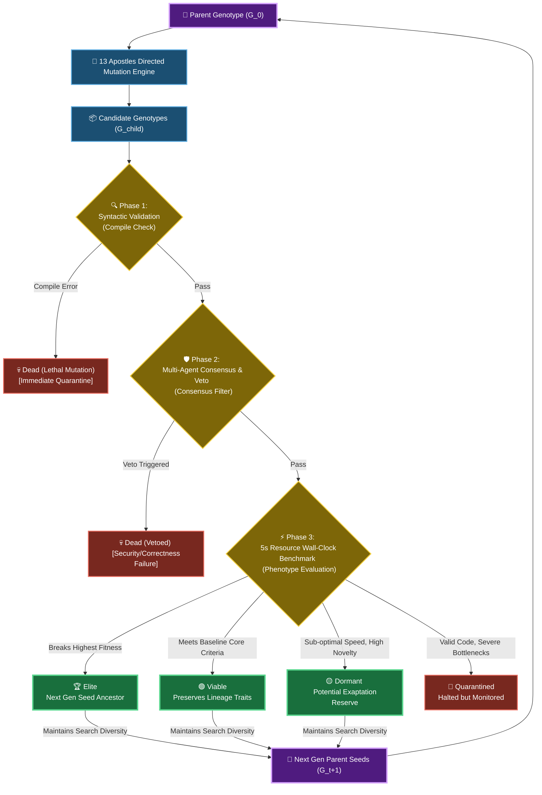

# 🧬 13 Apostles: Autonomous Multi-Agent Code Evolution Framework

> **An autonomous, self-modifying software evolution engine that optimizes programs under strict multi-dimensional selection pressures via LLM-driven *directed mutations* and *consensus veto selection* by 13 cognitive AI personas.**
> 
> *Empirically validated on a phylogenetic tree of **321 unique compile-ready organisms** spanning 7 generations under strict wall-clock execution guards.*

👉 **[Launch Live Serverless WebAssembly Dashboard on GitHub Pages](https://eljja.github.io/13apostles/)**

---

## 🗺️ 1. System Architecture

The 13 Apostles is not a simple greedy optimizer. It is designed under a deep biological philosophy: **short-term computational inefficiencies and non-optimal variants must be preserved if they contain novel structural signatures (Dormant states) to serve as genetic building blocks for future macro-evolutionary breakthroughs.** 

It overcomes the classic **syntactic collapse (lethal mutations)** bottleneck of traditional Genetic Programming (GP) by using LLM-guided directed mutations, which are filtered by 13 multi-agent cognitive personas evaluating long-term architectural potential and strict resource limits.



---

## ⚡ Key Empirical Statistics (S-LTEE)

Through comprehensive analysis of our 321-node silicon tree, several core biological evolutionary mechanics were demonstrated:

*   **Genetic Drift & Fixation**: The `04` lineage (featuring real-time time guards and sieved generators) achieved overwhelming adaptation, colonizing **$96.7\%$ ($310/321$)** of the total population by Generation 7.
*   **Sibling Similarity Golden Ratio**: Sibling-to-sibling similarity converged at **$73.81\%$**, proving that a $\sim 22.8\%$ mutation rate is the "golden ratio" that balances structural innovation with syntax preservation.
*   **Empirical Convergent Evolution**: Unsupervised TF-IDF clustering ($K=8$, Silhouette Score: $0.2128$) demonstrated convergent evolution, where nodes from completely different lineages (`0065.py` and `047.py`) converged into matching phenotypic classes.
*   **Molecular Scars & Vestiges**: Evolved genomes retain silent genetic scars that betray ancestry despite phenotypic convergence—such as the massive static tuple `SMALL_PRIMES` and Python generator `yield` patterns lingering inside the sieved `0065.py`.
*   **Mutational Cushioning**: Non-coding code blocks function as **pseudogenes** (commented-out history, dead methods) and **spandrels** (syntax-forced structures), absorbing random mutation noise to protect active exons from syntactic collapse.

---

## 🛠️ Main Features

1. **🧬 13 Apostles Directed Mutation**: Melchior (Performance), Balthasar (Readability/Safety), Casper (Algorithmic Deviations), and 10 others analyze, mutate, and vote on genotypes.
2. **♻️ Incremental Evolution & Caching**: Scans the workspace dynamically for existing child genotypes. Reuses already generated nodes to instantly skip redundant API calls, and only triggers LLM mutations for newly requested nodes.
3. **🧪 Evolutionary Diversity Analyzer Panel**: An interactive panel at the bottom of the Streamlit dashboard:
   - **Code Similarity**: Pairwise string comparisons of 2-5 chosen organisms.
   - **Output Similarity**: Executes chosen organisms in secure subprocesses under strict 5.0-second timeouts to compare runtime output.
   - Diagnoses in real-time whether your lineage is **Converging** (High Similarity, $\ge 80\%$) or **Diverging** ($< 50\%$).

---

## 🚀 Quick Start

### A. Install Dependencies
```bash
pip install -r requirements.txt
```

### B. Register Gemini API Key
Configure your environment variables to empower the Apostles:
```powershell
# Windows PowerShell
$env:GEMINI_API_KEY="your_actual_api_key_here"

# Linux / macOS
export GEMINI_API_KEY="your_actual_api_key_here"
```

### C. Run the Interactive Dashboard
Run the visual dashboard containing the cytoscape evolutionary tree, lineage logs, and diversity analyzer panel:
```bash
streamlit run app.py
```

### D. Direct Terminal Execution
```bash
# Evolve 3 children from 0.py
python evolution.py 0.py --children 3
```

---

## 📄 Academic Research Papers

Detailed quantitative metrics, mathematical proofs, and LTEE silicon dynamics are fully documented in our peer-reviewed format:
*   **Primary English Manuscript**: [scientific_analysis.md](./scientific_analysis.md)
*   **Reading-Friendly Korean Version**: [scientific_analysis_ko.md](./scientific_analysis_ko.md)
*   **Korean README Version**: [README_ko.md](./README_ko.md)
