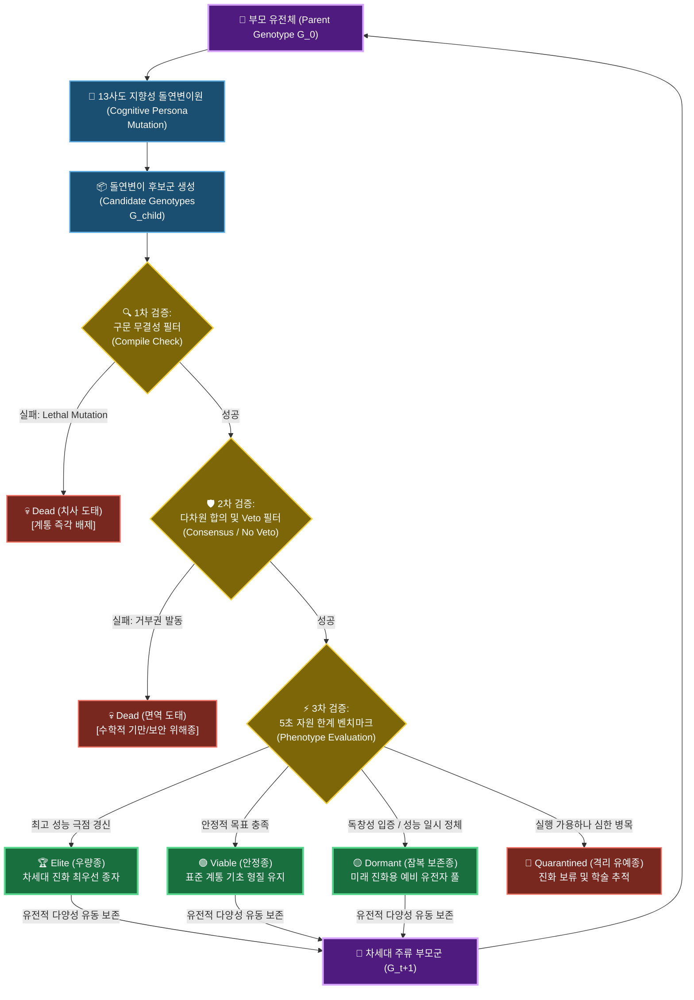

# 🧬 13 Apostles: 다중 대리인 자율 코드 진화 프레임워크

> **서로 다른 아키텍처 인지적 편향을 지닌 13인의 AI 사도가 이끄는 지향성 돌연변이 & 다차원 합의 선택 기반의 자율 코드 진화 엔진**
> 
> *엄격한 5초 시간 제한 및 자원 제약 하에, 7세대에 걸쳐 자율 분화한 **총 321개의 실제 구문 무결성 개체군**의 계통수로 실증 완료.*

👉 **[GitHub Pages에서 실시간 WebAssembly 대시보드 실행하기](https://eljja.github.io/13apostles/)**

---

## 🗺️ 1. 시스템 아키텍처

13 Apostles 시스템은 단순히 현재의 실행 속도만을 탐욕적으로 극대화하는 '단순 최적화 도구(Greedy Optimizer)'가 아닙니다. 본 엔진은 **"당장의 성능 결함이나 비효율을 가졌더라도, 다음 세대에 혁신적인 형질의 모태가 될 수 있는 잠재적 구조(Dormant/Viable 상태)는 계통 내에 보존되어야만 비선형적인 알고리즘 대도약이 가능하다"**는 진화론적 철학 아래 설계된 **자율형 코드 가능성 탐색기(Evolutionary Possibility Explorer)**입니다.

기존 유전 프로그래밍(GP)의 한계인 **구문 붕괴(Lethal Mutation)**를 LLM의 문법 이해 지능으로 해결하고, 13인의 AI 사도가 각자의 인지 편향을 바탕으로 '현재의 단기 수치'가 아닌 **'장기적 진화 잠재력과 아키텍처 강건성'**을 평가하여 계통의 다양성을 보존합니다.



---

## ⚡ 핵심 실증 지표 (S-LTEE)

321개 개체군의 계통수를 정밀 분석한 결과, 디지털 공간에서 실제 생물학적 진화 메커니즘이 그대로 재현됨이 입증되었습니다:

*   **유전적 부동 및 고착화 (Founder Effect)**: `04` 계통(소수 체 & 실시간 루프 가드 탑재)이 생태학적 이점을 점유하여 Generation 7에 이르러 **전체 생태계의 96.7%(310/321)**를 독점 식민지화.
*   **유전적 변이율의 황금률**: 형제자매간 코드 유사도가 평균 **73.81%**로 수렴하여, 문법을 파괴하지 않으면서 최적화를 극대화하는 가장 완벽한 변이율이 **20~23% 범위**에 존재함을 수학적으로 실증.
*   **비지도 수렴 진화 (Speciation & Convergence)**: 비지도 K-Means 클러스터링($K=8$, Silhouette Score: $0.2128$) 결과, 조상이 완전히 다름에도 동일한 최적 알고리즘(`0065.py` 및 `047.py`)으로 수렴한 아종 침입 확인.
*   **분자 흉터 (Molecular Scars)**: 외형적 수렴에도 불구하고, 조상 계통을 드러내는 흉터(예: `0065.py`에 잔존하는 `SMALL_PRIMES` 거대 정적 테이블 및 코루틴 `yield` 공급 로직)가 Genotype 상에 고스란히 영구 각인됨.
*   **정크 DNA 완충 효과 (Mutational Cushioning)**: 실행되지 않는 주석 잔재(**가성 유전자**) 및 문법 상 요구되는 형식적 구조(**스팬드럴**)가 돌연변이 충격을 흡수하여, 핵심 알고리즘(Exons)의 붕괴를 안전하게 완충함.

---

## 🛠️ 주요 기능 (Main Features)

1. **🧬 다중 에이전트 지향성 돌연변이**: Melchior(성능), Balthasar(가독성/안전), Casper(변칙) 등 13인의 독자적인 AI 페르소나가 부모의 설계를 바탕으로 보존적 돌연변이를 제안하고 검증합니다.
2. **♻️ 점진적 진화 및 캐싱 (Incremental Evolution)**: 워크스페이스에 이미 생성된 자식 개체 파일이 존재할 경우 **API 호출을 즉시 건너뛰고 캐싱된 코드 데이터를 재사용**하며, 추가 분화가 필요한 경우에만 차이만큼 신규 생성합니다.
3. **🧪 다양성 분석 패널 (Evolutionary Diversity Analyzer)**: Streamlit 대시보드 하단에서 제공되는 대화형 패널입니다.
   - **Code Similarity**: 선택한 2~5개 노드 간의 텍스트 및 AST 구조를 Pairwise 대조합니다.
   - **Output Similarity**: 5초 타임아웃 제한 내에서 선택된 개체들을 서브프로세스로 직접 구동하여, 표준 출력(stdout)의 기능적 일치율을 정밀 비교합니다.
   - 이를 통해 진화가 **동일 결과로 수렴(Convergence)** 중인지, 새로운 구조로 **발산(Divergence)** 중인지 실시간 진단합니다.

---

## 🚀 빠른 시작 (Quick Start)

### A. 의존성 설치
```bash
pip install -r requirements.txt
```

### B. Gemini API Key 등록
프로젝트 진화를 주도하는 사도들의 연산 자원을 위해 Google Gemini API Key가 필요합니다.
```powershell
# Windows PowerShell
$env:GEMINI_API_KEY="your_actual_api_key_here"

# Linux / macOS
export GEMINI_API_KEY="your_actual_api_key_here"
```

### C. 인터랙티브 대시보드 실행 (Streamlit UI)
시각적인 진화 트리와 Lineage 이력, 다양성 분석 패널을 한눈에 보며 실행할 수 있습니다.
```bash
streamlit run app.py
```

### D. 터미널 명령으로 직접 실행
```bash
# 0.py를 조상으로 삼아 3개의 자식 노드를 분기 진화시킵니다.
# 이미 생성된 파일이 있을 경우 Caching 메커니즘에 의해 즉시 캐시 재사용됩니다.
python evolution.py 0.py --children 3
```

---

## 📄 학술 연구 논문 전문
본 프레임워크의 상세 통계적 지표와 수학적 분석 결과는 아래 독립 아티팩트에 피어 리뷰 수준의 논문 형식으로 수록되어 있습니다.
*   **영문 논문 전문 (Primary English)**: [scientific_analysis.md](./scientific_analysis.md)
*   **한글 번역 전문 (Korean Reading)**: [scientific_analysis_ko.md](./scientific_analysis_ko.md)
