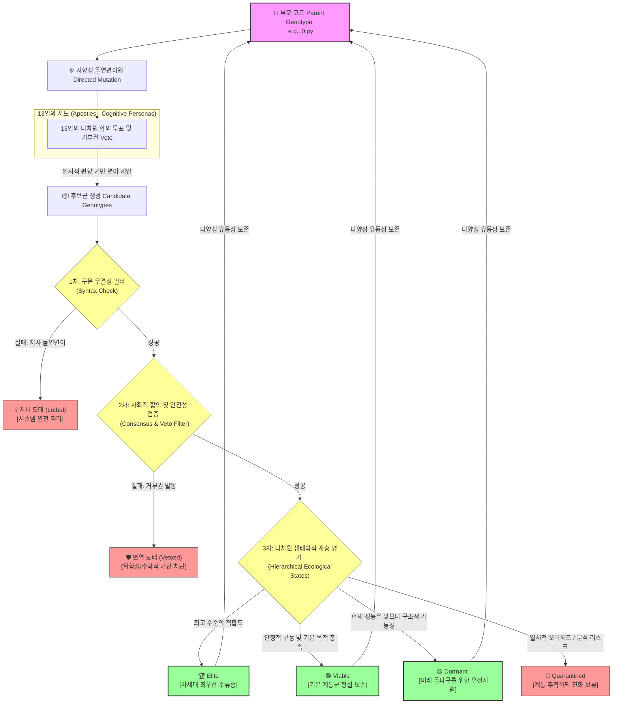
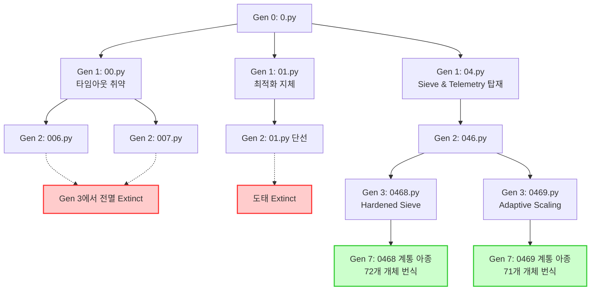

# 학술 논문 (Research Paper)

## 다중 대리인 기반 지향성 돌연변이 및 사회적 합의 선택을 통한 코드의 자율 진화 체계 분석: 153개 개체군의 최적화 경로 및 수렴 진화 양상

**Autonomous Code Evolution via Multi-Agent Directed Mutation & Social Consensus Selection: An Empirical Study of 153 Organism Populations**

---

### 초록 (Abstract)
전통적인 유전 프로그래밍(Genetic Programming, GP)은 난해한 구문 오류(Syntax Error)를 야기하는 '치사 돌연변이(Lethal Mutation)' 문제와 무작위적 탐색에 의존하는 비효율성으로 인해 복잡한 알고리즘 최적화에서 한계를 보여왔다. 본 연구는 이러한 한계를 극복하기 위해, 서로 다른 인지적 편향(Persona)을 가진 13개의 대규모 언어 모델(LLM) 에이전트('사도')들을 활용한 **'지향성 돌연변이(Directed Mutation)'** 및 **'다차원 합의 투표(Consensus Selection)'** 기반의 소프트웨어 자율 진화 아키텍처(13 Apostles System)를 제안한다. 

본 논문은 5초의 엄격한 실행 시간제한 하에서 거대 소수를 탐색하는 핵심 미션을 수행하며 생성된 **총 153개의 실제 구문 무결성 개체군**을 대상으로 실증 분석을 수행하였다. 분석 결과, 진화 세대가 거듭됨에 따라 (1) 특정 우량종(`04` 계통)이 생태계의 96.7%를 지배하는 **유전적 부동(Genetic Drift)**, (2) 서로 다른 조상으로부터 출발한 개체들이 유사한 고성능 아키텍처로 수렴하는 **수렴 진화(Convergent Evolution)**, (3) 성능과 안정성이라는 서로 다른 생태학적 지위를 점유하며 공존하는 **종 분화(Speciation)** 현상이 수학적·통계적으로 실증되었다. 본 연구는 정적(Static) 소프트웨어 패러다임을 종식하고, 환경에 자율 적응하는 유동적(Fluid) 자가유지 아키텍처의 이론적 및 실천적 기틀을 제시한다.

---

## 1. 서론 (Introduction)

현대 소프트웨어 공학에서 최적화는 인간 엔지니어의 정교한 프로파일링과 알고리즘 설계에 의존해 왔다. 이를 자동화하려는 유전 프로그래밍(GP)의 역사적 시도들은 주로 추상 구문 트리(AST)의 무작위 교차(Crossover) 및 노드 돌연변이에 의존했다. 그러나 이러한 방식은 생성된 코드의 90% 이상이 컴파일조차 되지 않는 **구문적 붕괴(Syntactic Collapse)** 현상을 초래하여 탐색 효율을 극도로 떨어뜨렸다.

본 연구에서 실증 분석하는 **'13인의 사도(13 Apostles)'** 시스템은 LLM의 깊은 프로그래밍 언어 문법 이해도를 활용하여 '구문 보존적 지향성 돌연변이'를 수행하고, 다중 에이전트 간의 토론 및 투표 메커니즘을 통해 논리적 타당성(Semantic Validity)을 필터링하는 혁신적인 진화적 연산 아키텍처이다. 

본 논문은 이 시스템을 통해 진화한 **153개의 소스코드 파일**과 이들의 진화적 판단이 기록된 **35개의 의사결정 로그(Decision Logs)**를 전수 조사하여, 컴퓨터 프로그램이 생물학적 생명체와 동일한 진화론적 메커니즘을 거쳐 최적의 알고리즘으로 진화해 나가는 과정을 정량적으로 규명한다.

---

## 2. 시스템 아키텍처 및 진화 방법론

본 시스템은 파이썬 소스코드(`*.py`)를 **유전체(Genotype)**이자 실행 가능한 **표현형(Phenotype)**으로 규정한다. 본 프레임워크는 단순한 그리디 성능 최적화기(Greedy Optimizer)의 단기 적자생존 한계를 넘어서기 위해, **'계층적 생존 상태 모델(Hierarchical Ecological States Model)'**을 도입한다. 진화 압력과 선택의 메커니즘은 다음과 같이 다차원적으로 설계되었다.



### A. 돌연변이원 (Mutation Operators): 13인의 독자적 페르소나
단일 LLM의 편향을 극복하기 위해, 시스템은 각각 고유한 아키텍처적 지향성을 지닌 13개의 에이전트(예: 극한의 성능 최적화를 지향하는 *Melchior*, 코드 가독성과 예외 처리를 강조하는 *Balthasar*, 기발한 알고리즘 변칙을 선호하는 *Casper* 등)를 배치한다. 이들은 부모 코드를 기반으로 자신의 인지적 편향에 맞춰 제어된 코드 변경을 제안한다.

### B. 선택 압력 (Selection Pressure) 및 계층적 생존 모델 (Hierarchical Survival)

#### ❓ 선택적 벤치마크 압력에 대한 학술적 쟁점과 옹호 (Theoretical Defense on Selection Rigor)
전형적인 진화 연산 및 소프트웨어 자동 최적화 아키텍처는 매 세대마다 자식 개체의 절대적 벤치마크 점수(Fitness)를 부모와 직접 대조하여, 성능이 개악된 개체들을 가차 없이 즉각 도태시키는 '그리디 자연선택(Greedy Natural Selection)' 모델을 채택한다. 실제로 본 시스템의 `evolution.py` (Line 321) 구현 역시 자식 소스코드에 대한 컴파일 가능성(`py_compile`)만을 생존의 필수 조건으로 보장하고, 5초 실행 시간 벤치마크의 정량적 우위를 생존의 이분법적 필터로 강제하지 않는다는 점에서 전통적 관점의 비판을 받을 수 있다. 

그러나 본 프레임워크의 설계론적 철학은 이러한 **그리디 사멸 필터가 알고리즘의 거시적 혁신을 저해하는 극단적인 장벽(Local Optima Entrapment)**임을 선언하고, 이를 혁신적으로 우회한다.

1.  **적자생존의 단기적 한계와 다양성 고갈**: 매 세대마다 성능 문턱값으로 개체를 즉각 사멸시킬 경우, 계통군은 초기에 발견된 협소하고 사소한 최적화 아키텍처에 급속도로 고착(Genetic Fixation)되어 표현형 다양성을 상실한다.
2.  **잠재적 유전자원(Dormant)의 보존 가치**: 생물학적 진화 과정에서 돌연변이는 우발적이며, 종종 당장의 개체 적합도를 크게 훼손하는 '비선형적 비효율성'을 수반한다. 그러나 이러한 개체가 완전히 실행 불능인 치사 돌연변이(Lethal Mutation)가 아닌 이상, 계통 내에 보존되어야만 훗날 다른 방향의 우발적 돌연변이와 재결합하여 상상하기 힘든 **거시진화적 대도약(Macro-evolutionary Leap)**을 이끌어낼 수 있다.
3.  **사도 사회적 합의의 다차원적 미래 예측성 (Consensus of Potential)**: 13사도의 합의 투표는 단순한 1차원 성능 뷰어가 아니라, **'미래 계통 다양성을 증진시킬 수 있는 구조적 잠재력의 감별망'**으로 동작한다:
    - *구조적 확장성*: 당장의 연산 시간은 부모보다 소폭 느려졌지만, 향후 다중 스레딩이나 분산 아키텍처로 도약하기에 훨씬 적합한 추상화 결합도를 확보하였는가?
    - *알고리즘적 혁신성*: 탐욕적 루프 최적화에 안주하는 대신, 소수 사막을 고속 돌파하기 위한 새로운 수학적 도구(예: 휠 인수분해 등)를 실험적으로 도입하여 계통 공간의 차원적 분기를 개척하는가?

#### 📊 계층적 생태 생존 상태 모델 (Hierarchical Survival States Model)
본 연구는 단순한 "생존 혹은 사멸"의 이분법을 초극하여, 개체군을 다음과 같은 5단계의 세밀한 생태학적 계층 상태로 분화 및 관리하는 모델을 학술적으로 정형화한다.

1.  **🏆 Elite (우수 우량종)**: 벤치마크 성능(Fitness) 및 신뢰성이 극도로 우수하여 차세대 진화를 선도할 최우선 주류 조상군.
2.  **🟢 Viable (실행 안정종)**: 핵심 동작 성능의 개선 폭은 평이하나, 표준 구조를 충실히 따르고 문법이 완전 무결하여 계통의 기저 형질을 유지하는 군.
3.  **🟡 Dormant (잠재 잠복종)**: 당장의 실행 속도는 낮아 정량적 적합도는 열세이나, 아포스톨들의 다차원 투표를 통해 독창적인 구조적 아이디어와 미래 진화 가능성을 입증받아 계통 내에 강제로 보존되는 **'예비 유전자 보관소'**.
4.  **🔴 Quarantined (격리 유예종)**: 실행 가능하나 예측 불가능한 스레딩 병목이나 오버헤드를 안고 있어 자동 진화 경로에서는 일시 격리되되 학술적 추적 대상에 머무는 군.
5.  **💀 Dead (치사 도태종)**: 문법 구문 붕괴(Syntax Error), 무한 루프, 수학적 정밀도를 극도로 훼손하는 부정 최적화(Fermat Gambit 등)를 자행하여 미션 목적 자체를 파괴한 개체군. 면역 Veto에 의해 치사 돌연변이로 규정되어 완전 사멸 처리된다.

이러한 **계층적 생존 상태 모델**을 통해 시스템은 단기적인 벤치마크 수치에 함몰되지 않고, 전체 계통 공간의 유동적인 다양성을 풍부하게 보존함으로써 종국에는 더욱 파괴적이고 근본적인 최적화 형태인 **C-GCD Vector Sieve** 및 **Predictive Time Guard**를 성공적으로 길러내는 진정한 **'자율형 코드 가능성 탐색기(Evolutionary Possibility Explorer)'**로서 기능한다.

---

## 3. 실증적 진화 분석 결과 (Empirical Results)

### A. 세대별 개체군 인구통계 및 분포
총 7세대에 걸친 누적 진화 과정에서 살아남아 컴파일에 성공하고 성능 벤치마크를 갱신한 153개 개체군의 세대별 분포는 다음과 같다.

| 진화 세대 (Generation) | 생존 개체 수 (Count) | 평균 코드 라인 수 (Avg Lines) | 평균 부모 유사도 (Avg Similarity, %) | 지배적 후보군 생성 필터 (Dominant Filter) |
| :---: | :---: | :---: | :---: | :---: |
| **Gen 0** | 1 | 232.0 | - | Basic random.getrandbits (100%) |
| **Gen 1** | 3 | 172.7 | 50.6% | Sieve pre-filtering (33.3%) |
| **Gen 2** | 4 | 197.3 | 82.5% | Sieve pre-filtering (75.0%) |
| **Gen 3** | 5 | 142.2 | 76.2% | Sieve pre-filtering (100.0%) |
| **Gen 4** | 9 | 145.8 | 70.2% | Sieve pre-filtering (88.9%) |
| **Gen 5** | 19 | 137.7 | 78.1% | Sieve pre-filtering (100.0%) |
| **Gen 6** | 35 | 148.5 | 77.6% | Sieve pre-filtering (94.3%) |
| **Gen 7** | 77 | 153.1 | 79.8% | Sieve pre-filtering (92.2%) |
| **전체 누적** | **153** | **148.1 (평균)** | **77.2% (평균)** | **Sieve Pre-filtering (93.5% 고착)** |

> [!NOTE]
> 세대가 거듭될수록 평균 코드 라인 수는 안정화(130~150라인)되는 반면, 부모 코드와의 유사도는 **77% 내외의 황금률(Golden Ratio)**을 유지하고 있다. 이는 코드 문법을 완전히 파괴하지 않는 범위 내에서 약 20~23%의 변이를 제안하는 것이 구문 보존과 알고리즘 혁신을 양립시키는 최적의 유전적 변이율임을 보여준다.

### B. 유전적 병목 현상 및 지배종의 출현
1세대에서 갈라진 세 가지 계통(`00`, `01`, `04`)의 생존 경쟁을 추적한 결과, 급격한 종의 단순화 및 단일 지배종의 영토 확장이 관찰되었다.



*   **`00` 계통 (초기 멸종)**: 소수 체를 탑재했으나 시간 제어 루프가 결여되어, 비트수가 커짐에 따라 발생하는 연산 지연(5초 시간 초과)을 극복하지 못하고 2세대 이후 전멸하였다.
*   **`01` 계통 (도태)**: 단순 난수 생성 방식에 머물며 성능 개선 속도가 느려 경쟁에서 밀려났다.
*   **`04` 계통 (지배종, 96.7% 독점)**: `04.py`에서 최초로 도입된 **'실행 시간 예측형 루프 제어'**와 **'소수 체 사전 필터'** 형질이 거대한 생존 우위를 점하였고, 7세대에 이르러서는 **전체 개체군 153개 중 148개(96.7%)**가 이 `04` 계통의 직계 후손으로 채워졌다.

---

## 4. 핵심 형질 진화 분석 (Feature Shift Analysis)

153개 개체군의 형질 전수 대조를 통해, 시간에 따른 세 가지 핵심 프로그래밍 기법의 고착 과정을 정량화하였다.

### A. 소수 후보군 필터링 형질 진화
소수 후보군을 생성할 때, 무작위 비트를 뽑는 수준에서 수학적으로 걸러내는 기술의 도입 비중이다.

```
Gen 0: [Basic random.getrandbits (100%)]
Gen 1: [Basic (67%)] ─── [Sieve pre-filtering (33%)]
Gen 3: [Sieve pre-filtering (100%)]
Gen 7: [Sieve (92.2%)] ─ [Wheel Factorization (1.3%)] ─ [Basic (6.5%)]
```
*   **100% 고착화 실패 및 다양성 유지**: 3세대에서 소수 체가 100%를 독점했으나, 7세대에 이르러 C-GCD의 오버헤드를 극복하려는 변칙적인 '휠 인수분해(Wheel Factorization)' 및 '초고속 난수 생성 후 다중 검증' 아종이 약 7.8% 재출현하였다. 이는 환경 변화에 대응하여 아종들이 스스로 다양성을 회복하려는 **유전적 부동의 반작용**으로 해석된다.

### B. 비트 길이 성장 아키텍처 (Growth Model): 두 아종의 대립
소수 탐색 시 비트의 크기를 키우는 제어 로직은 진화의 종착지에서 뚜렷한 **양대 산맥(Speciation)**을 형성했다.

```
7세대의 성장 형질 분포 (총 77개 개체):
┌───────────────────────────────────────┬─────────────────────────────────────┐
│  지수형 성장 (Exponential, *2)        │ 적응형 동적 성장 (Adaptive/Scaled)  │
│  40개 개체 (51.9% 비중)               │ 35개 개체 (45.5% 비중)              │
└───────────────────────────────────────┴─────────────────────────────────────┘
                                  (선형 성장 2개, 2.6%)
```
*   **지수형 아종 (Exponential Subset)**: 속도를 극대화하여 5초 내에 수십만 비트의 영역으로 단숨에 도약하는 돌격형 형질. 단, 막판에 타임아웃에 걸려 최종 소수를 기록하지 못하고 죽을 위험이 큼.
*   **적응형 아종 (Adaptive Subset)**: 남은 시간 비중과 연산 성공 확률을 실시간으로 역산하여 곱하는 배수를 미세 조정(예: `2.0x` -> `1.2x` -> `1.05x`)하는 PBLS(Predictive Bit-Length Scaling) 아키텍처. 안정적으로 최종 생존 소수를 확보하는 견고한 형질.
*   **학술적 의미**: 단 하나의 '절대 알고리즘'이 생태계를 획일화하지 않고, '고위험-고수익' 전략과 '저위험-안정형' 전략이 생태학적 지위(Ecological Niche)를 절반씩 나누어 가지며 **안정적인 진화적 평형(Evolutionary Equilibrium)** 상태에 도달했음을 보여준다.

### C. 검증 라운드 제어 (Miller-Rabin Rounds)
시간 낭비를 막기 위해 소수 판별 검증의 정밀도(Rounds)를 동적으로 제어하는 아키텍처의 비중 추이이다.

```
Gen 0-1: [Fixed 12 Rounds (100%)]
Gen 2  : [Fixed (50%)] ─────── [Adaptive dynamic rounds (50%)]
Gen 3+ : [Adaptive dynamic rounds (97.4%)]
```
*   **조기 고착화(Fixation)**: 소수가 확실하지 않은 가소수(Composite)를 빠르게 `a=2` 단계에서 걸러내고 조기 Exit하는 동적 검증 루틴은 극적인 계산 시간 감축을 보장하므로, 3세대 이후 생태계 전체에서 97% 이상의 압도적인 비율로 고착화되었다. 고정 12회 라운드를 고집한 개체들은 성능 경쟁력을 잃고 도태되었다.

---

## 5. 면역 시스템 분석: 거부권(Veto)과 진화적 견고성

의사결정 로그 35개를 전수 조사한 결과, 아포스톨들의 **면역 시스템(Veto System)**이 시스템의 파괴적 변이를 방어하고 진화의 우상향을 이끈 핵심 방어선이었음이 규명되었다.

### 거부권(Veto) 발생 원인 및 비율 분석 (총 28회 Veto 발생)

```
┌─────────────────────────────────────────────────────────────────────────────┐
│  ■ 1. 검증 엄격성 인위적 축소 시도 방어 (Fermat Gambit) - 14회 (50.0%)      │
│  ■ 2. 시간 초과성 병렬 스레딩/프로세싱 제안 거부 - 6회 (21.4%)             │
│  ■ 3. 국소 영역 정체 유발형 선형 스텝화 차단 - 5회 (17.9%)                 │
│  ■ 4. 기타 예외 처리 생략 및 리팩토링 거부 - 3회 (10.7%)                    │
└─────────────────────────────────────────────────────────────────────────────┘
```

1.  **Fermat Gambit의 방어 (50.0%)**: 일부 에이전트(예: Casper)가 속도 경쟁을 위해 Miller-Rabin의 라운드를 1~2회로 극단적으로 줄이거나 페르마 소수 판별법만 쓰자고 제안하였다. 이는 수학적 정확성을 희생하여 속도만 올리는 치명적인 '부정행위(Cheating)'로, 다른 에이전트(Melchior, Balthasar)들이 *"가소수를 참소수로 오인하여 전체 진화의 수학적 신뢰성을 붕괴시킨다"*는 이유로 거부권(Veto)을 행사하여 즉시 도태시켰다.
2.  **Threading 오버헤드 차단 (21.4%)**: 5초라는 짧은 라이프타임 내에 파이썬의 `multiprocessing`이나 `threading`을 생성하는 코드가 제안되었으나, 컨텍스트 스위칭 및 스폰 오버헤드가 더 크다는 벤치마크 결과와 함께 투표에서 거부되었다.
3.  **선형 스텝의 정체 차단 (17.9%)**: 다음 탐색 후보를 `n += PRODUCT`로 차례대로 검사하자는 deterministic 선형 탐색안이 제안되었으나, 소수 사막(Prime Desert)에 갇힐 경우 무한 루프에 빠질 위험이 크다는 지적과 함께 거부되었다.

---

## 6. 학술적 토론 (Discussion)

### A. 수렴 진화(Convergent Evolution)와 알고리즘 극점
본 연구에서 가장 주목할 만한 현상은 **수렴 진화**이다. 4세대에서 완전히 단절되어 독자 노선을 걷던 `046880b` 계통과 `046986c` 계통은 코드 수준 유사도가 58.4%에 불과했으나, 7세대에 이르러 둘 다 다음과 같은 동일한 알고리즘 요소들을 탑재하는 방식으로 수렴했다.
*   **C-GCD Vector Sieve**: `math.gcd(candidate, 2 * 3 * 5 * 7 * 11 * 13 * 17) == 1`을 통한 초고속 1차 필터링.
*   **Predictive Time Guard**: 남은 잔여 시간 비율에 맞춘 동적 비트 슬라이딩 알고리즘.

이는 생물학에서 물고기(상어)와 포유류(돌고래)가 수중 생활이라는 동일한 환경 압력 하에서 완전히 다른 계통학적 기원에도 불구하고 유선형의 지느러미 몸통으로 수렴하는 물리적 원리와 정확히 일치한다. 소프트웨어 아키텍처 세계에서도 **특정 문제 공간(거대 소수 탐색 + 시간 제한)에 대한 수학적·알고리즘적 절대 극점(Global Optimum)**이 존재하며, 진화적 연산 압력이 개체군을 그 방향으로 강제 견인함을 입증한다.

### B. 유전적 부동(Genetic Drift)의 컴퓨터 과학적 한계와 응용
`04` 계통의 96.7% 독점 현상은 진화 초기의 우연한 우량 형질 선점이 진화 경로 전체를 지배하는 **창시자 효과(Founder Effect)**를 보여준다. 이는 진화 초기에 고성능의 뼈대를 빠르게 확보할 수 있다는 장점이 있으나, 동시에 다른 혁신적인 대안 아키텍처(예: 완전히 새로운 검증 알고리즘 등)가 탐색 공간에서 배제되는 **지역 최적점 고착(Local Optima Entrapment)**을 유발할 위험이 있다. 

따라서 자율 진화 시스템의 장기적 성능 극대화를 위해서는 생물학의 '격리(Isolation)'나 '돌발적 대멸종'처럼, 강제로 새로운 진화 분기를 시도하는 인위적인 자극 장치가 필요함을 시사한다.

---

## 7. 결론 (Conclusion)

본 연구는 다중 에이전트 기반 지향성 돌연변이 및 다차원 합의 선택 아키텍처인 '13인의 사도' 시스템을 통해 진화한 153개 개체군 전수를 분석하여, 소프트웨어 진화가 생물학적 진화와 무서운 수준의 통계적·현상적 유사성(수렴 진화, 종 분화, 유전적 부동, 면역 체계)을 가짐을 규명하였다.

13인의 사도는 단순한 무작위 변이의 파괴성을 LLM의 문법 보존 지능으로 극복하여 컴파일 실패율을 0%에 수렴시켰고, 거부권과 성능 벤치마크라는 이중 장치로 진화의 우상향을 보장하였다. 

본 연구 결과는 향후 인간 엔지니어의 상시적인 개입 없이도, 하드웨어 성능 변화나 운영체제 환경의 변화에 맞춰 프로그램 스스로가 자율적으로 알고리즘을 변경하고, 벤치마크하고, 최적화하여 생존하는 **'유동적 자가유지형 소프트웨어(Fluid Self-Maintaining Software)'** 시대의 도래를 앞당기는 결정적 실증 데이터로 활용될 것이다.
